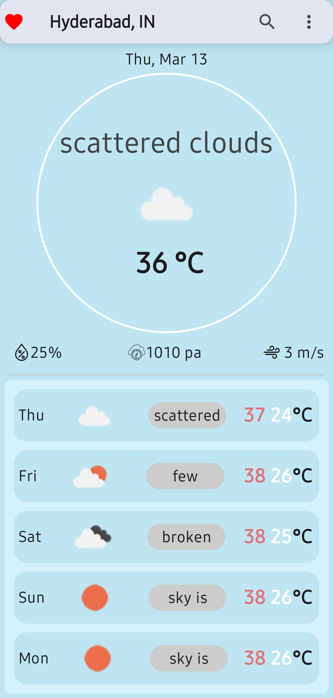
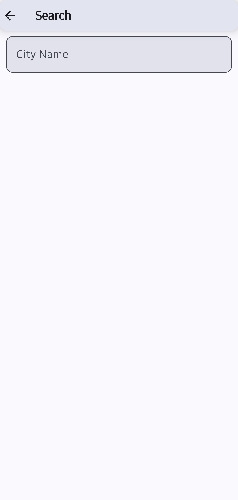
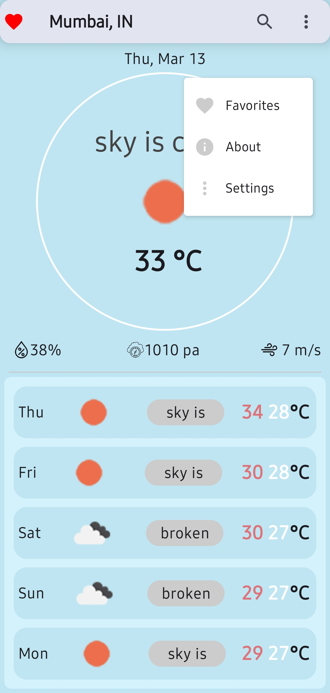
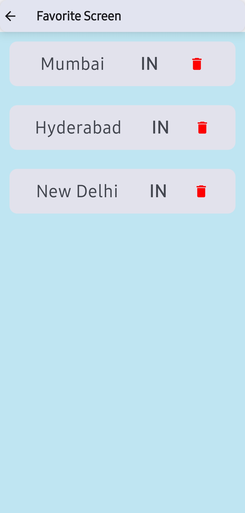
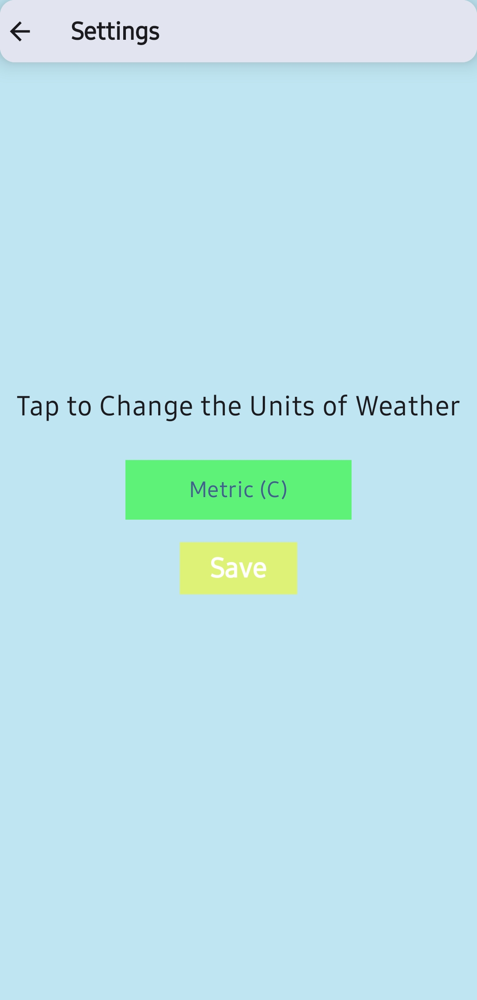
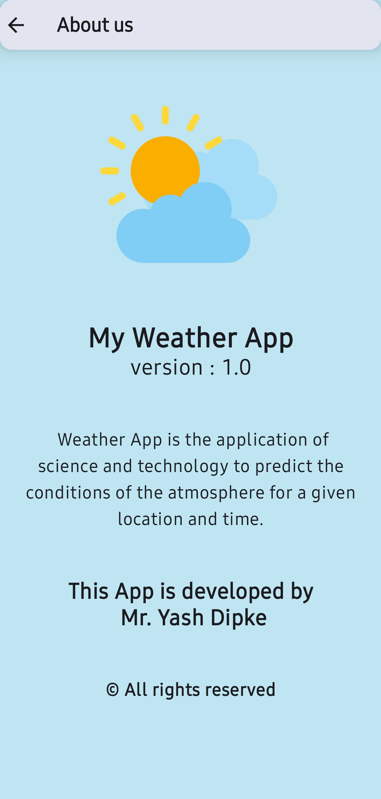

# Weather Forecasting Android App

## 🌦 Overview
This is a **Weather Forecasting Android App** built using **Jetpack Compose**. It provides real-time weather updates, forecasts, and other meteorological data using a weather API.

## 🚀 Features
- 🌍 **Real-time Weather Data**: Fetches current weather conditions.
- 📅 **5-Day Forecast**: Displays upcoming weather predictions.
- 🎨 **Jetpack Compose UI**: Modern, responsive, and intuitive design.
- 📡 **API Integration**: Uses Retrofit to fetch data from a weather API.
- 🔧 **Dependency Injection**: Utilizes Hilt & Dagger for modular architecture.

## 🏗 Tech Stack
- **Language**: Kotlin
- **UI**: Jetpack Compose
- **Network**: Retrofit
- **DI**: Hilt & Dagger
- **Local Storage**: Room Database

## 📲 Installation
### 1. Clone the repository
```sh
git clone https://github.com/mrYassh/WeatherApp
cd Weather-Forecast-App
```

### 2. Open in Android Studio
- Open **Android Studio**
- Click **Open an Existing Project**
- Select the cloned repository

### 3. Get an API Key
- Sign up on [OpenWeatherMap](https://openweathermap.org/) or any weather API provider.
- Obtain an API key.
- Add the key to `local.properties`:
  ```
  WEATHER_API_KEY=your_api_key_here
  ```

### 4. Run the App
- Connect an **Android device** or use an **emulator**.
- Click **Run ▶** in Android Studio.

## 📸 Screenshots

### 🏠 Home & Navigation  
<p align="center">
  
  
  
</p>

### ⚙️ Features & Settings  
<p align="center">
  
  
  
</p>


## 🤝 Contributing
Contributions are welcome! Feel free to open an issue or submit a pull request.

---
> 🌟 **Don't forget to ⭐ this repo if you find it useful!**

